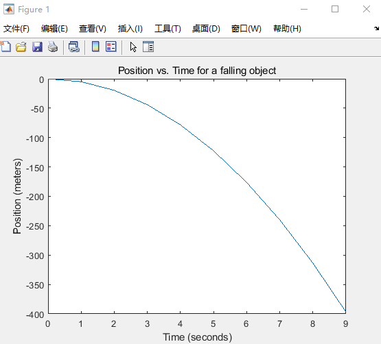
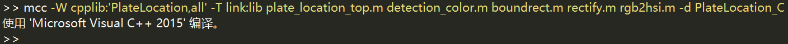
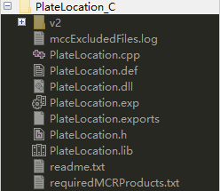
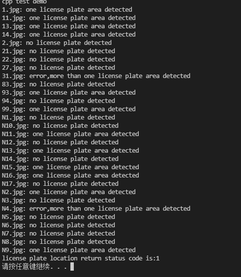

### 1 简介

在一些复杂算法的实现上，比如图形绘制和界面编辑上又十分繁琐，而Matlab在这些方面有凸显出了优势。若结合二者之长处，以C++为基础，将Matlab强大的运算能力运用起来，在处理一些问题上会方便许多。C++调用Matlab主要有两种方式，一种是调用Matlab的计算引擎，即调用Matlab本身；另一种是调用Matlab中由mcc编译生成的dll文件，这种方法是Matlab利用C++ Complier将m文件转化为C++源码，产生能够完全脱离Matlab运行环境独立执行的DLL程序，从而能够在C++程序中调用DLL实现对Matlab代码的利用。

### 2 Matlab Cpp Engine

- 在C中添加一个头文件：”include “engine.h”之后可以使用Matlab引擎提供的一些常用函数。

```cpp
int engine_demo()
{
	Engine *ep;
	mxArray *T = NULL, *result = NULL;
	char buffer[BUFSIZE + 1];
	double time[10] = {0.0, 1.0, 2.0, 3.0, 4.0, 5.0, 6.0, 7.0, 8.0, 9.0};

	/*
	 * Call engOpen with a NULL string. This starts a MATLAB process 
     * on the current host using the command "matlab".
	 */
	if (!(ep = engOpen("")))
	{
		fprintf(stderr, "\nCan't start MATLAB engine\n");
		return EXIT_FAILURE;
	}

	/*
	 * PART I
	 *
	 * For the first half of this demonstration, we will send data
	 * to MATLAB, analyze the data, and plot the result.
	 */

	/* 
	 * Create a variable for our data
	 */
	T = mxCreateDoubleMatrix(1, 10, mxREAL);
	memcpy((void *)mxGetPr(T), (void *)time, sizeof(time));
	/*
	 * Place the variable T into the MATLAB workspace
	 */
	engPutVariable(ep, "T", T);

	/*
	 * Evaluate a function of time, distance = (1/2)g.*t.^2
	 * (g is the acceleration due to gravity)
	 */
	engEvalString(ep, "D = .5.*(-9.8).*T.^2;");

	/*
	 * Plot the result
	 */
	engEvalString(ep, "plot(T,D);");
	engEvalString(ep, "title('Position vs. Time for a falling object');");
	engEvalString(ep, "xlabel('Time (seconds)');");
	engEvalString(ep, "ylabel('Position (meters)');");

	/*
	 * use fgetc() to make sure that we pause long enough to be
	 * able to see the plot
	 */
	printf("Hit return to continue\n\n");
	fgetc(stdin);
	/*
	 * We're done for Part I! Free memory, close MATLAB figure.
	 */
	printf("Done for Part I.\n");
	mxDestroyArray(T);
	engEvalString(ep, "close;");

	/*
	 * PART II
	 *
	 * For the second half of this demonstration, we will request
	 * a MATLAB string, which should define a variable X.  MATLAB
	 * will evaluate the string and create the variable.  We
	 * will then recover the variable, and determine its type.
	 */

	/*
	 * Use engOutputBuffer to capture MATLAB output, so we can
	 * echo it back.  Ensure first that the buffer is always NULL
	 * terminated.
	 */

	buffer[BUFSIZE] = '\0';
	engOutputBuffer(ep, buffer, BUFSIZE);
	while (result == NULL)
	{
		char str[BUFSIZE + 1];
		char *input = NULL;
		/*
	     * Get a string input from the user
	     */
		printf("Enter a MATLAB command to evaluate.  This command should\n");
		printf("create a variable X.  This program will then determine\n");
		printf("what kind of variable you created.\n");
		printf("For example: X = 1:5\n");
		printf(">> ");

		input = fgets(str, BUFSIZE, stdin);

		/*
	     * Evaluate input with engEvalString
	     */
		engEvalString(ep, str);

		/*
	     * Echo the output from the command.  
	     */
		printf("%s", buffer);

		/*
	     * Get result of computation
	     */
		printf("\nRetrieving X...\n");
		if ((result = engGetVariable(ep, "X")) == NULL)
			printf("Oops! You didn't create a variable X.\n\n");
		else
		{
			printf("X is class %s\t\n", mxGetClassName(result));
		}
	}

	/*
	 * We're done! Free memory, close MATLAB engine and exit.
	 */
	printf("Done!\n");
	mxDestroyArray(result);
	engClose(ep);

	return EXIT_SUCCESS;
}
```




- 在C++中添加一个头文件：“#include "MatlabEngine.hpp"，MATLAB 引擎 API 提供 C++ 编程语言与 MATLAB 之间的接口，此 API 使 C++ 程序能够启动 MATLAB、计算带参数的 MATLAB 函数，并在 MATLAB 和 C++ 程序之间交换数据。

```cpp
// 使用 MATLAB gcd 函数求两个数值的最大公约数
void use_engine(){
    //Pass vector containing MATLAB data array array

    using namespace matlab::engine;

    // Start MATLAB engine synchronously
    std::unique_ptr<MATLABEngine> matlabPtr = startMATLAB();
    std::cout << "Started MATLAB Engine" << std::endl;

    //Create MATLAB data array factory
    matlab::data::ArrayFactory factory;

    //Create vector of MATLAB data array arrays
    std::vector<matlab::data::Array> args({
        factory.createScalar<int16_t>(30),
        factory.createScalar<int16_t>(56)
    });

    //Call gcd function, get 3 outputs
    const size_t numReturned = 3;
    std::vector<matlab::data::Array> result = matlabPtr->feval(u"gcd", numReturned, args);

    //Display results
    for (auto r : result) {
        std::cout << "gcd output: " << int16_t(r[0]) << std::endl;
    }
}
```

### 3 Compile Matlab to Cpp Library

使用MCC将Matlab函数编译成dll文件，同时也会使用C++ Complier(Windows推荐MSCVC)将m文件转化为C++源码。

#### 3.1 GUI编译

Matalab提供GUI界面和命令行两种编译方式。GUI操作步骤比较繁琐，按照提示选择文件以及配置参数，然后编译即可。


#### 3.2 命令行编译

##### 3.2.1  命令简介

`mcc -W cpplib:library_name[,{all|legacy|generic}] options mfilename1 mfilename2...mfilenameN` compiles the listed functions into a C++ shared library and generates C++ wrapper code for integration with other applications.

- *`library_name `*— Specifies the name of the shared library
- *`all`*— Generates shared libraries using both the mwArray API and the generic interface that uses the MATLAB Data API. This is the default
- *`legacy`*— Generates shared libraries using the mwArrayAPI
- *`generic`*— Generates shared libraries using the MATLAB Data API

**Use the mwArray API**

```shell
#使用MATLAB矩阵API
mcc -W 'cpplib:mymagic,legacy' mymagic.m
```

**Use the MATLAB Data API**

```shell
#使用MATLAB数据API
mcc -W 'cpplib:mymagic,generic' mymagic.m
```

**Use both the `mwArray` API and the MATLAB Data API**

```shell
#两者均用
mcc -W 'cpplib:mymagic,all' mymagic.m
#或者默认两者均使用
mcc -W 'cpplib:mymagic' mymagic.m
```

##### 3.2.1  命令使用

- Matlab源码见[UlovHer/LicensePlateRecognition: License plate recognition and positioning, using traditional image processing algorithms. And package it into a library. (github.com)](https://github.com/UlovHer/LicensePlateRecognition)

```
# 编译成DLL命令
mkdir LicensePlateLocation_C
mcc -W cpplib:'LicensePlateLocation,all' -T link:lib license_plate_location.m plate_location_kelnel.m minboundrect.m rgb2hsi.m rectify.m detection_color.m -d LicensePlateLocation_Java
```





#### 3.3 调用Library

```cpp
int use_dll()
{
    //mclmcrInitialize();
    //if (!mclmcrInitializeApplication(NULL, 0))
    //{
    //	std::cout << "Could not initialize the application" << std::endl;
    //	return -1;
    //}

    if (!LicensePlateLocationInitialize())
    {
        std::cout << "Could not initialize the LicensePlateLocation" << std::endl;
        return -1;
    }
    //初始化可以鉴定Matlab外部调用环境设置是否正确
    std::cout << "cpp call matlab dll" << std::endl;

    char detect_folder[] = "../../../data/test_dataset/plate_set1/";

    char output_folder[] = "../../../data/test_dataset/detect_result/";
    char suffix[] = "*.jpg";

    mwArray detect_folder_array(detect_folder);
    mwArray output_folder_array(output_folder);
    mwArray suffix_array(suffix);
    mwArray status_code(output_folder);
    license_plate_location(1, status_code, detect_folder, suffix, output_folder);
    std::cout << "license plate location return status code is:" << status_code << std::endl;
    return status_code;
}
```

